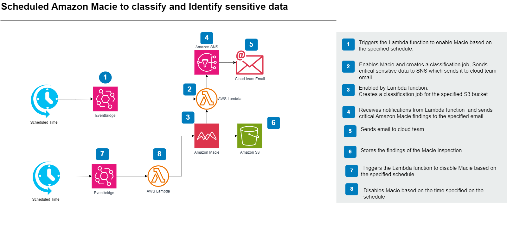

# AWS CloudFormation Template for Amazon Macie Automation

## Description

This CloudFormation template automates the process of enabling Amazon Macie, performing a classification job on a specified S3 bucket, sending the results via SNS, and then disabling Amazon Macie. The template allows you to configure the exact times for enabling and disabling Macie using cron expressions and to receive findings via email.

## Parameters

- **pBucketName**: The name of the S3 bucket to inspect with Amazon Macie.
- **pEnableTime**: The exact time to enable Macie in cron format (UTC). Example: `cron(0 9 * * ? *)` for 9:00 AM UTC.
- **pDisableTime**: The exact time to disable Macie in cron format (UTC). Example: `cron(0 9 * * ? *)` for 9:00 AM UTC.
- **pNotificationEmail**: The email address to send the findings to. Default: `mxolisi.tshezi@batsamayi.com`.
- **pEnvironment**: Distinguish between development, test, and production resources. Allowed values: `dev`, `test`, `beta`, `prod`, `sbx`. Default: `sbx`.
- **pLayer**: Identify a specific application layer of resources. Allowed values: `database`, `presentation`, `api`, `network`, `cicd`. Default: `presentation`.
- **pProject**: Identify projects that the resource supports. The name should be lowercase and without hyphens or underscores. Default: `wow`.
- **pMacieResults**: A name for the Macie results bucket. Default: `macie-results`.
- **pPrefix**: A prefix for resource naming. Default: `bty`.

## Resources

- **S3 Bucket**: Stores the results of the Macie classification job.
- **Amazon Macie Session**: Configures Amazon Macie to inspect S3 buckets.
- **SNS Topic**: Receives notifications with Macie findings.
- **Lambda Functions**: 
  - **EnableMacieLambdaFunction**: Enables Macie, creates a classification job, and sends findings via SNS.
  - **DisableMacieLambdaFunction**: Disables Macie.
- **EventBridge Rules**:
  - **EnableMacieTrigger**: Triggers the enabling of Macie at a specified time.
  - **DisableMacieTrigger**: Triggers the disabling of Macie at a specified time.
- **IAM Roles and Permissions**: Grants necessary permissions to Lambda functions for interacting with Macie, S3, and SNS.

## Architecture Diagram

The architecture diagram for this solution illustrates the components and their interactions:

1. **Amazon Macie**: Enabled and disabled based on scheduled triggers.
2. **S3 Bucket**: Used for storing Macie classification results.
3. **Lambda Functions**: Automate the enabling and disabling of Macie and handle the classification job.
4. **SNS Topic**: Receives and notifies findings via email.
5. **EventBridge Rules**: Schedule Lambda function execution to manage Macie.

## Setup

1. **Deploy via AWS Service Catalog**: The CloudFormation stack will be deployed through AWS Service Catalog in the management account. Ensure that you have configured the Service Catalog with the appropriate permissions and portfolio settings.

2. **Configure Notifications**: Verify that the SNS topic is correctly configured to send email notifications. Ensure the provided email address is correct.

3. **Verify Execution**: After deployment, verify that the Lambda functions are triggered at the specified times, and check the S3 bucket and SNS topic for Macie results.

## Usage

- **Enable Macie**: Macie will be enabled at the time specified by `pEnableTime`.
- **Disable Macie**: Macie will be disabled at the time specified by `pDisableTime`.
- **Receive Findings**: Critical Findings from the Macie classification job will be sent to the specified email address.
